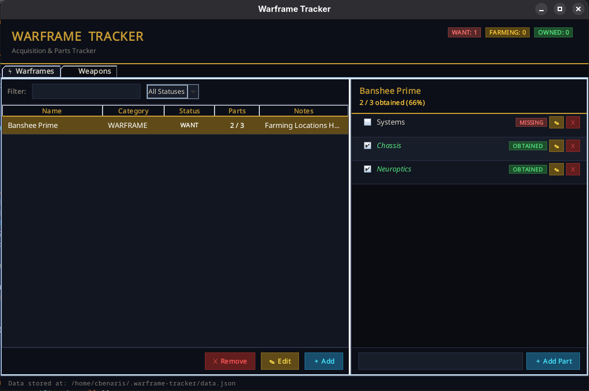

# Warframe Tracker

A cross-platform desktop app to track Warframes and Weapons you want to acquire, including individual part progress.



## Requirements
- Java 17 or newer (JRE is sufficient — no JDK needed to run)
- Download Java: https://adoptium.net

## Running the App

### Linux / macOS
```bash
java -jar WarframeTracker.jar
```

### Windows
Double-click `WarframeTracker.jar` if Java is associated, or run:
```cmd
java -jar WarframeTracker.jar
```

## Data Storage

Your data is saved automatically to:
| Platform | Path                                              |
|----------|---------------------------------------------------|
| Linux    | `~/.warframe-tracker/data.json`                   |
| macOS    | `~/.warframe-tracker/data.json`                   |
| Windows  | `C:\Users\<YourName>\.warframe-tracker\data.json` |

The file is plain JSON — you can open and edit it directly if needed.

## Features
- Track **Warframes** and **Weapons** (Primary, Secondary, Melee, Arch-Gun, Arch-Melee, Sentinel Weapon)
- Set status: **WANT** → **FARMING** → **OWNED**
- Add **parts** to each item and tick them off as you obtain them
- Parts panel shows obtained/missing badges and overall progress percentage
- Filter by status and weapon type
- Search by name
- Add notes to each item
- Data persists automatically between sessions
- Double-click any row to edit it

## Building from Source
```bash
javac -d out src/com/warframetracker/*.java
jar cfm WarframeTracker.jar manifest.txt -C out .
```

## Importing into Eclipse
1. **File → New → Java Project**
2. Uncheck "Use default location" and point it at the source folder
3. On the next screen ensure the JRE System Library is on the **Classpath** (not Modulepath)
4. Click **Finish** — when prompted to create a `module-info.java`, click **Don't Create**
